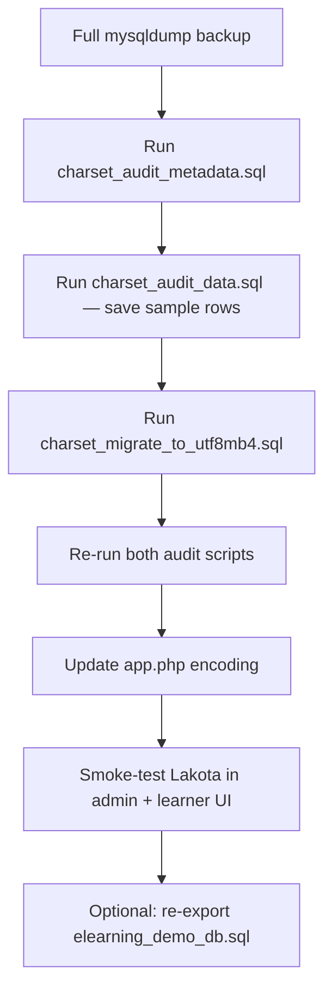

# Database charset migration (utf8mb4)

Guide for standardizing the eLearning database on **MySQL 8** using full Unicode (`utf8mb4`) and the MySQL 8 default collation (`utf8mb4_0900_ai_ci`).

Use this when upgrading from MySQL 5.7 / PHP 7.4-era dumps that mix `latin1`, `utf8` (utf8mb3), and `utf8mb4`.

## Why migrate

| Legacy charset | Problem |
|----------------|---------|
| `latin1` | Cannot store Lakota and other Unicode text correctly |
| `utf8` / utf8mb3 | Deprecated in MySQL 8; 3-byte UTF-8 only (no emoji, incomplete Unicode) |
| Mixed collations | Join / `ORDER BY` errors or silent conversion between tables |

**Target state:**

- Database default: `utf8mb4` + `utf8mb4_0900_ai_ci`
- All tables and text columns: same charset and collation
- CakePHP connection: `'encoding' => 'utf8mb4'` in `backend/config/app.php`

## Scripts (`core/scripts/sql/`)

| File | Purpose |
|------|---------|
| [`charset_audit.sql`](../../scripts/sql/charset_audit.sql) | Pointer — run the two audit files below separately |
| [`charset_audit_metadata.sql`](../../scripts/sql/charset_audit_metadata.sql) | Inventory: database default, table/column charsets, index length risk, zero-date defaults |
| [`charset_audit_data.sql`](../../scripts/sql/charset_audit_data.sql) | Content spot-checks: non-ASCII Lakota text, mojibake heuristics |
| [`charset_migrate_to_utf8mb4.sql`](../../scripts/sql/charset_migrate_to_utf8mb4.sql) | Converts all 61 demo-schema tables + sets database default |

Edit `@schema_name` / database name in the audit scripts if your database is not `elearning_demo_db`.

## Procedure overview



## Step 1 — Backup

```bash
mysqldump --single-transaction --routines --triggers elearning_demo_db > backup-before-utf8mb4.sql
```

Run on a **staging copy** first if migrating production.

## Step 2 — Audit (before migration)

### Metadata audit

In phpMyAdmin, open the SQL tab on **`elearning_demo_db`** and run **`charset_audit_metadata.sql`** alone.

| Section | What to record |
|---------|----------------|
| 1 | Current database default charset/collation |
| 2 | Count of tables per collation (`latin1`, `utf8`, `utf8mb4`) |
| 3 | Full list of tables still to convert — this is your migration checklist |
| 4 | Column-level mismatches (e.g. `files`, `lessons.name`) |
| 5 | Long indexed `VARCHAR` columns — informational; rarely blocks migration on MySQL 8 |
| 6 | Zero-date defaults — fix before or during migration (see [Known errors](#known-errors)) |

### Data audit

Run **`charset_audit_data.sql`** in a **separate** phpMyAdmin execution (do not paste it together with the metadata audit).

| Result | Meaning | Action |
|--------|---------|--------|
| Non-ASCII rows in `cards`, `reference_dictionary`, etc. | Real Lakota/Unicode content | **Expected.** Note a few `id` values to compare after migration |
| Empty non-ASCII results | Demo has little multibyte text | OK for demo; run on production if it has more content |
| Mojibake rows (`Ã`, `Â`, `â€`) | Possible charset corruption | Open those rows in the app; fix bad data before or after migration as needed |
| Empty mojibake results | No obvious corruption | Good |

**Important:** Non-ASCII rows are not a problem to fix — they confirm Unicode content exists. Mojibake rows are the ones to investigate.

### phpMyAdmin tip

Do **not** combine metadata and data audits in one paste. Mixing `information_schema` queries with `FROM cards` can drop the default database and cause:

```text
#1109 - Unknown table 'CARDS' in information_schema
```

The data audit uses fully qualified table names (`elearning_demo_db`.`cards`) and a leading `USE` statement to avoid this.

## Step 3 — Migrate

Run **`charset_migrate_to_utf8mb4.sql`** on `elearning_demo_db`.

The script:

1. **Phase 1** — Curriculum / Lakota content tables (cards, lessons, exercises, dictionary, …)
2. **Phase 2** — Users, forums, email, schools, settings
3. **Phase 3** — Progress, roles, junction tables
4. **Step 5** — `ALTER DATABASE` to set default `utf8mb4` / `utf8mb4_0900_ai_ci` for **new** tables

`ALTER TABLE ... CONVERT TO` rewrites each table. Plan a maintenance window on large production databases.

If migration stops partway through, fix the reported error and continue from the failed `ALTER TABLE` — already-converted tables are safe to convert again.

## Step 4 — Audit (after migration)

Re-run **`charset_audit_metadata.sql`**:

- **Section 1:** `charset` = `utf8mb4`, `collation` = `utf8mb4_0900_ai_ci`
- **Section 3:** **0 rows** (no tables left on `latin1` or `utf8`)
- **Section 4:** **0 rows** (no column charset mismatches)
- **Section 6:** **0 rows** (no zero-date defaults)

Re-run **`charset_audit_data.sql`** and compare noted card/dictionary IDs — Lakota text should match pre-migration.

## Step 5 — Application config

In `backend/config/app.php`, set both datasources:

```php
'encoding' => 'utf8mb4',
```

Replace the legacy `'utf8'` value (utf8mb3 over the wire). `App.encoding` can remain `UTF-8` for HTML.

## Step 6 — Smoke test

- Admin: open cards, dictionary entries, lessons with Lakota text
- Learner UI: exercise prompts and review content
- Forums and user names if production has non-ASCII data

## Step 7 — Optional: refresh demo dump

After validating locally, re-export `core/demo/elearning_demo_db.sql` from the migrated database so new installs start on `utf8mb4`.

When creating a database in phpMyAdmin, choose collation **`utf8mb4_general_ci`** or **`utf8mb4_0900_ai_ci`** (see [Collation choice](#collation-choice)).

## Known errors

### `#1109` — Unknown table in information_schema

**Cause:** phpMyAdmin lost the default database when metadata and data queries ran in one batch.

**Fix:** Run `charset_audit_metadata.sql` and `charset_audit_data.sql` as separate scripts.

### `#1067` — Invalid default value for `created`

**Cause:** MySQL 8 rejects `DEFAULT '0000-00-00 00:00:00'` when a table is rebuilt. Affected demo tables: `global_fires`, `review_queues`.

**Fix:** Included in `charset_migrate_to_utf8mb4.sql` — datetime columns are changed to `DEFAULT NULL` in the same `ALTER` as the charset conversion. CakePHP sets `created` / `modified` in PHP; NULL is safer than a fake date.

Find other tables with metadata audit **section 6** before migrating.

## Collation choice

| Collation | When to use |
|-----------|-------------|
| `utf8mb4_0900_ai_ci` | **Recommended** for MySQL 8 — server default, better Unicode sorting |
| `utf8mb4_general_ci` | Acceptable if matching an existing partial migration (e.g. `school_roles`) |

Charset (`utf8mb4`) matters more than collation for storing Lakota. Use one collation everywhere to avoid join issues.

## What `ALTER DATABASE` does and does not do

| Does | Does not |
|------|----------|
| Default for new tables and columns | Convert existing tables |
| Align new CakePHP migrations with MySQL 8 | Replace per-table `CONVERT` statements |

Run the database `ALTER` **after** all tables are converted (Step 5 in the migration script).

## Related docs

- [SQL scripts index](../scripts/sql/README.md)
- [CakePHP migrations](migrations.md)
- [Demo database import](../demo/README.md)
- [Local server setup](../getting-started/local-server-setup.md) — MySQL version and `sql_mode`
